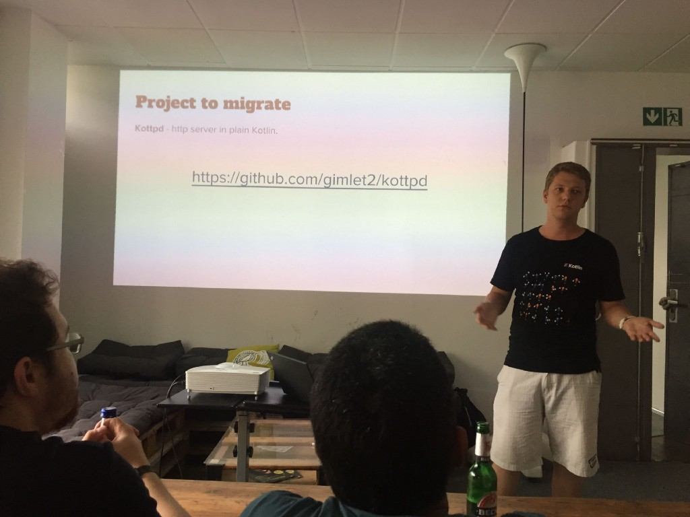

Nowadays when popularity of Kotlin grows faster then ever JetBrains puts a lot of energy to bring us new Kotlin universe — [Kotlin-Native](https://github.com/JetBrains/kotlin-native). Kotlin-Native allows us to build native apps. It based on [LLVM](http://llvm.org/) compiler and supports various of platforms. It still somewhere far from being production ready but we already have the third release — [version&nbsp;0.3](https://github.com/JetBrains/kotlin-native/releases/tag/v0.3)

I have one let’s say pet-project I’ve already [wrote](/2016/11/16/kottpd/) about — [kottpd](https://github.com/gimlet2/kottpd). It is simple HTTP-server written entirely in Kotlin. From this two facts I’ve made obvious decision — I need to try to port my library to Kotlin-Native! But that is not only for fun. There is one dream behind it — to make it possible to build web apps in Kotlin but with possibility to run them with native performance.
<!-- more -->

Well, to be honest, it is only an experiment for now. But let’s see where this experiment will lead&nbsp;later.

As a first step I’ve cut all unimportant parts out — SSL support, files serving, exception handling and even multi-thread support. And it still was able to serve HTTP requests. Great! Let’s move&nbsp;on.

The second step was a little bit harder. I had to go through all codebase and remove all direct references to JVM classes. In my case it was java.net. **ServerSocket** , java.net. **Socket** , java.io. **OutputStream** , java.io. **OutputStreamWriter** , java.io. **PrintWriter** , java.io. **BufferedReader** , java.io. **InputStream** , java.io. **InputStreamReader** , java.io. **IOException** , java.lang. **System**. Not that big&nbsp;list.

Instead of all those classes I’ve introduced corresponding interfaces and exceptions. And that help me to isolate all platform dependent logic from, let’s say, business logic of the library. On that moment I did check how it works once again. And it was fine. Time to move to Kotlin-Native!

The code was copied to separate folder. And I had no idea what to do next. But, thanks to JetBrains team, we have some examples that come along with Kotlin-Native. For inspiration I choose [**socket**](https://github.com/JetBrains/kotlin-native/tree/master/samples/socket) sample. There I took **build.gradle** file and **sockets.def** for configuring C interop. On that moment I realized how far Kotlin-Native is from production use right now — there is no IDE support. That remind me old good times at school with Pascal — change code, compile, read error messages, fix code =)! And that what we have now with Kotlin-Native. Most of the time error messages give you enough information to actually get what is&nbsp;wrong.

Beside pure tooling I’ve faced not so many issues — **fun main(args: Array\<String\>)**— must be in a file without package, type conversions from native world and back are two biggest of&nbsp;them.

But anyway I made it work! In one thread, crashing time to time with segmentation fault but still serving HTTP requests!

There is more thoughts to improve it — bring all pieces removed due to simplification back, introduce multi-threading and improve build process to make it actually one application with common code&nbsp;base!

If you interested in this experiment please follow on&nbsp;[github](https://github.com/gimlet2/kottpd/tree/nativizy).