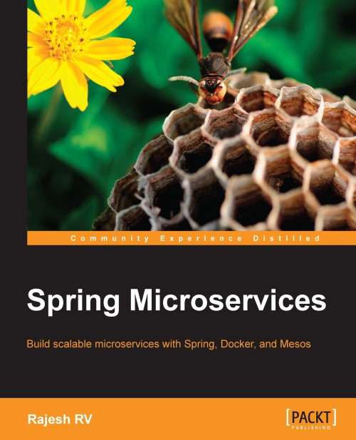

Recently I’ve read **“Spring Microservices”** book by **Rajesh RV** and here I want to try to summarize it. The book was published in June 2016. But, it seems, it is still relevant.

#### Microservices isn’t just for developers pleasure but also business&nbsp;demand.

Yes, sure, it’s extremely interesting and fun to plan and implement scalable and distributed systems but developers should always keep in mind why we are doing that — to evaluate faster on business processes, reduce the cost of the experiment.
<!-- more -->

#### Meaningful health check is important

Self-healing is significant for microservice architecture. And to provide it your service has to report its health state accurate. For example, your service is deployed in **Kubernetes** cluster and exposes **/health** endpoint. Then it will be possible to restart it in case of failure and reroute traffic to a health node instead. Also, it helps you to understand your app better, know all significant dependencies and requirements.

#### Spring Cloud is a good choice for microservices

…if you do not afraid of such vendor-lock. In case if your platform is 100% based on Spring stack it seems pretty logical to try to solve microservices challenges with help of **Spring Cloud**. Bunch of cool project from **Spring Cloud Config** till **Spring Cloud Streams** helps you to build reliable and manageable system. But if you run your services for example on top of **Kubernetes** you will get alternative solutions for those issues for free(like service discovery, load balancing, etc.).

#### Distributed tracing brings transparency into the&nbsp;system

On that field Spring provides us **Spring Cloud Sleuth** solution. It works on top of **Zipkin** , Cloudera or Dapper. As result of integration, you will be able to add to your log messages what’s called **Trace-Id** and Span-Id, so you can track request chain across entire system for example in **Kibana**. Super useful for debugging, dependency analysis, etc.

#### Autoscaling

…isn’t trivial process. Beside of technical support of autoscaling from your platform(for example, Kubernetes has it but limited, but there are some third-party extensions to improve it), you really need to think about scaling policies, pay attention what limits your app performance.

Of course, there are much more useful tips in this book. Here is only some point I focus my attention on. In total — it worth to spend some time and&nbsp;read.