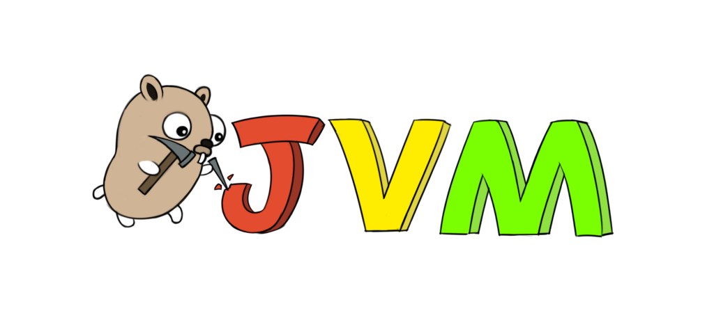

I have been doing development for **JVM** platform for quite some time already. It was **Java** back in time, now it is **Kotlin**. And everything seems logical here — here is your **Maven** , **Gradle** or whatever project description with versioned dependencies, when you do build — the artifact is right here. It gives you a sense of workspace. It is easy to develop multiple projects in parallel — they all are isolated from each&nbsp;other.

But then the new player comes in that perfect world —  **Go**.
<!-- more -->
<figcaption>image from <a href="https://github.com/zxh0/jvm.go">https://github.com/zxh0/jvm.go</a></figcaption>
**$GOROOT**? **$GOPATH**? WTF? Where are project’s dependencies? Is there something like versions? And where are my binaries?!

I believe that such design of the ecosystem has some rational core and reasoning. But from my(probably not just my) experience it looks like completely parallel universe.

To deal with it my first approach was to replicate expected **$GOPATH** folders structure in the project directory —  **bin** , **src** and **pkg**. Then create correct import path inside **src** folder — like **github.com/gimlet2/\<someproject\>** and checkout project itself there. After this manipulations updating of **$GOPATH** environment variable to point to the project directory. Well, too complicated.

To improve it a little bit I’ve decided to use dep package manager. And it became better. Now for each project, I was able to provide a list of dependencies with exact versions. Maybe that isn’t really the **Go** way, but I like&nbsp;it.

But still, it was far from ideal. Maybe virtual environment can be helpful here? It is widely used in Python to fix the similar issue. And the first thing I’ve found on **Github** was [goenv](https://github.com/crsmithdev/goenv). This project isn’t under active development but it does the&nbsp;job.

It is pretty easy to&nbsp;use:

1. Install it go get github.com/crsmithdev/goenv
2. checkout your&nbsp;project
3. then, in your project folder do goenv init github.com/me/myproject
4. active virtual environment&nbsp;. goenv/activate

Cool, it works! But **dep** is an issue now. It verifies that your project is located inside appropriate **$GOPATH**. And **goenv** creates virtual **$GOPATH** in **~/.goenv/\<project name\>**. Inside this folder, it also creates **bin** , **pkg** and src folders and folders structure that you’ve specified with goenv init command. Almost the same steps I was doing manually before. And it makes a symlink to your actual project folder. So, I’ve improved **goenv** a little bit to cd into this virtual project folder on activating of the environment.

Now you can run dep ensure right away or start your code editor(personally I use [Visual Studio Code](https://code.visualstudio.com/) for Go development), work with git, etc. I’ve provided this change as a pull request to the original project. But you can also install it from my fork — go get [github.com/gimlet2/goenv](https://github.com/gimlet2/goenv)&nbsp;.

Maybe that setup isn’t the best but it works for me. At least now I know what is where and can setup new project in one&nbsp;command.