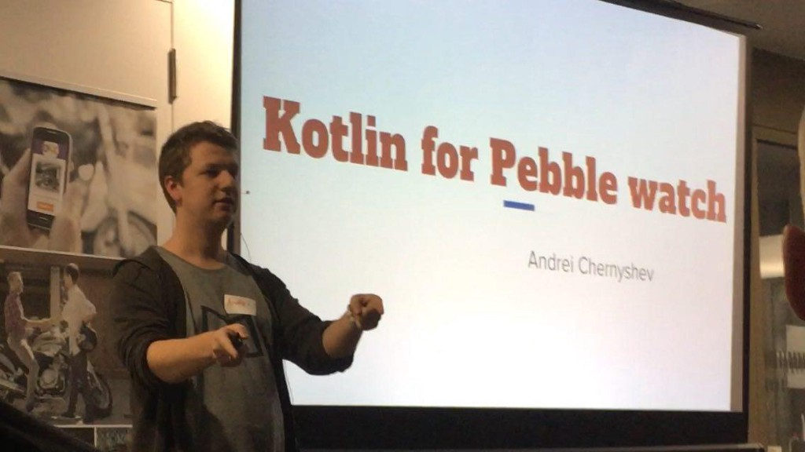

The best Smartwatchs are [**Pebble**](https://www.pebble.com/). Even taking into account that the company producing them was sold, and there will be no more new devices it is still best smartwatchs you can&nbsp;buy.

It is specially true if you are a software developer or just love to play with code. **Pebbles** provides you with powerful but simple **SDK** for **C** and **Javascript**. And cool web IDE —[**CloudPebble**](https://cloudpebble.net/). As a result, it is super easy to develop apps and watchfaces.
<!-- more -->

But you probably know I am a big fan of [**Kotlin**](http://kotlinlang.org/), so **C** and **Javascript** were not definitely enough for me! Since **Kotlin-native** at this moment doesn’t support the platforms are used in **Pebble** I’ve decided to go with **KotlinJS**.

**KotlinJS** is a way to transpile **Kotlin** code to **Javascript**. As a starting point, I took this repo — [https://github.com/pebble/pebblejs](https://github.com/pebble/pebblejs). This repo provides you the way to develop apps for **Pebble** in **Javascript** locally.

First, you need to follow this [https://developer.pebble.com/sdk/install/](https://developer.pebble.com/sdk/install/) instructions to setup **PebbleSDK**. Also, you need to setup Kotlin command line tools. I am using [**SDKMan**](http://sdkman.io/) for that. As soon as you have all that you are good to&nbsp;go.

So, I’ve made a fork of **pebblejs** repo — [https://github.com/gimlet2/pebblekt](https://github.com/gimlet2/pebblekt). The first thing to check here is **build.sh** script. It has three&nbsp;steps:

1. Build Kotlin code to Javascript with **kotlinc-js**
2. Remove unused code with help of **kotlin-dce-js**
3. And **pebble build** to actually produce artifact for&nbsp;Pebble
4. The last step which is not the part of the script — installation — you can use different options of **pebble install** &nbsp;command.

The last thing to focus on — **src** &nbsp;folder:

1. in **js** folder you will find original **PebbleJS** SDK. Also a result of **Kotlin** transpiling is also could be found here in **app.js** &nbsp;file.
2. **KotlinJs** standard library could be found in **kotlinjs** folder. It is huge but **kotlin-dce-js** is there to fix&nbsp;this.
3. And finally, **kotlin** folder contains bindings to js code(for example **ui.kt** ), some helper functions in **pebble.kt** and **app.kt**  — the application code.

If you build and run this code you’ll get typical _Hello world_&nbsp;app.

With this project I want to try to expand **Kotlin** to a new platform. Worth to mention the latest release of **Kotlin-native** ([0.6.0](https://github.com/JetBrains/kotlin-native/releases/tag/v0.6)) with a support of **STM32** chips. But that is a story for another&nbsp;post.