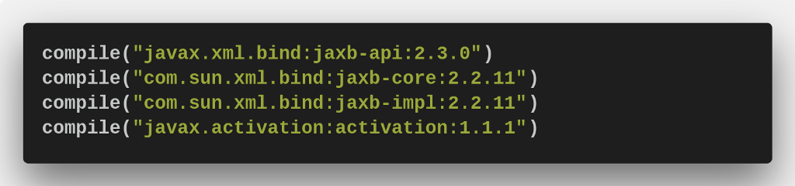
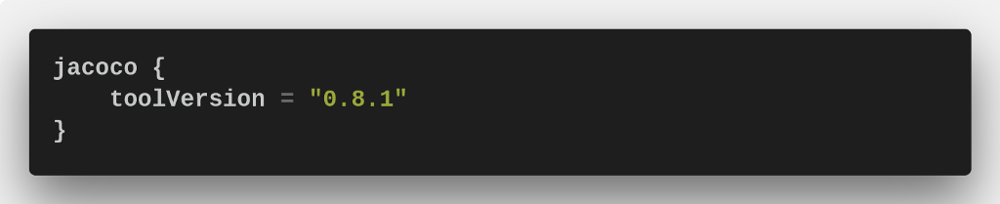
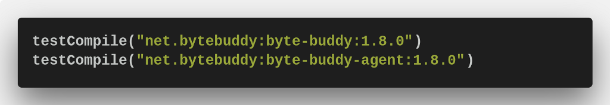

As you probably know [**Java 10**](http://jdk.java.net/10/) was recently released. Not so many new features. At least for [**Kotlin**](http://kotlinlang.org) developers… But there are [several improvements](http://www.oracle.com/technetwork/java/javase/10-relnote-issues-4108729.html) to **JVM** itself. And, I guess, there will be more in upcoming versions. Which we will get twice a year from now! So, I think it is better to take some time and sync your projects to make it easier in future to migrate with the same speed.

The main project I’m involved into is **SpringBoot** 1.5.X based service made with **Kotlin** and it uses **Postgres** as a data base. At this moment it uses **Java 8**. Such a great chance to skip **Java 9** and jump directly to 10! Being inspired by this thought I have opened my laptop.
<!-- more -->
I use [**SDKman**](http://sdkman.io) to install Java but for **Java 10** it delivers broken version for some unknown reason. So this time I had to download bundle from the official [website](http://jdk.java.net/10/) manually.

The biggest issue is that some libraries are no longer part of **JDK**. That is good news — it is getting cleaner. But as a result, you need to define additional dependencies for your project. You can also include them with command line parameters since they are actually still in **JDK** but I think it is better to move them into dependencies because as far as I’ve understood they gonna be removed in future releases completely. In my case it was:

The second issue was [**Jacoco Gradle plugin**](https://docs.gradle.org/current/userguide/jacoco_plugin.html). If you use it to measure the code coverage there is good news— **Jacoco** itself supports **Java 10**. But to make **Jacoco Gradle plugin** work I had to specify the tool version like this in my gradle build file:

And the last part that was broken — [**Mockito**](http://site.mockito.org/). That issue could be solved by adding a fresh version of [**Bytebuddy**](http://bytebuddy.net/) library like this:

After these modifications, I was able to build and run my project and all tests were green. Don’t be afraid to migrate! Next step would be to prepare **Dockerbuild** file. But that is a topic for the next article.